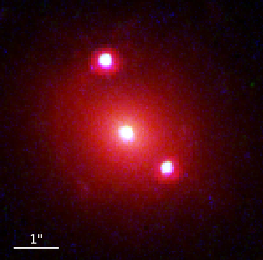

# Hello world

[Home](index.md) | [Research](research.md) | [Awards](awards.md)

<table>
  <tr>
    <td style="width: 40%;">
      
    </td>
    <td style="padding-left: 20px; vertical-align: top;">
      <h2>My Research</h2>
      

        I work on analyzing doubly imaged quasars to measure time delays and constrain the Hubble constant. This involves modeling lens mass distributions and source light profiles using HST data and the <code>lenstronomy</code> library.
      

    </td>
  </tr>
</table>
